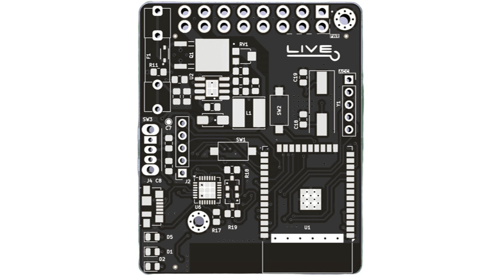
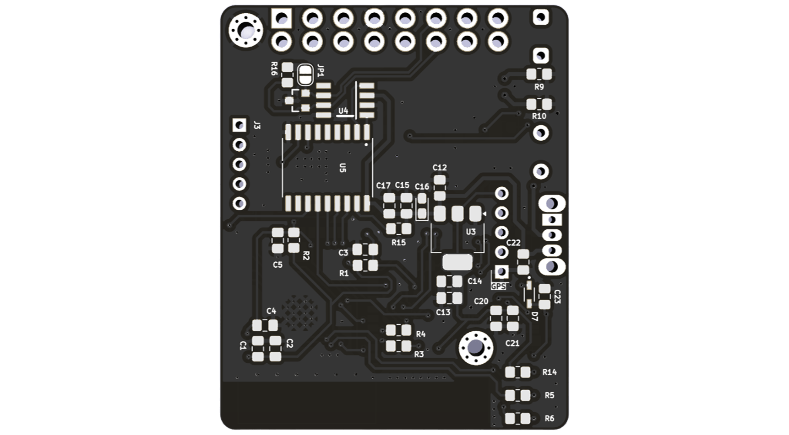
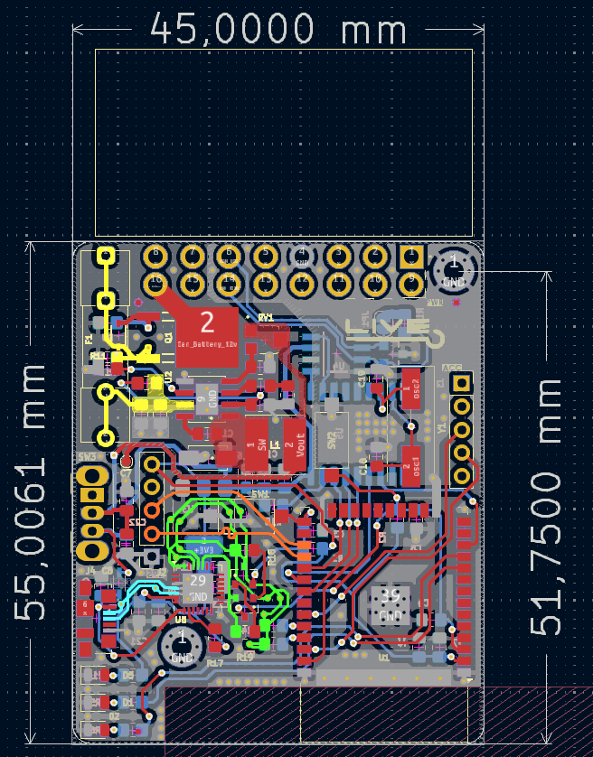

# Dongle-eaLIVE-PCB

## Hardware
Dongle-eaLIVE has been created using KiCad and all the design files can be found under [01_Specs](01_Specs/) folder (you can see in this folder the [Schematic](01_Specs/01_Schematic/), [LayoutPCB](01_Specs/02_LayoutPCB/) and [3Dmodel](01_Specs/03_3Dmodel/)) , and the  production can be found in [Gerber](02_Gerber&BOM/01_Gerber/) files and the interactive BOM in [BOM](02_Gerber&BOM/02_BOM/00_InteractiveBOM/). Images below shows a quick overview of the hardware design.

| PCB Front           |  PCB Back |
| :-------------------------: | :-------------------------: |
|   |  |

### Dimensions

